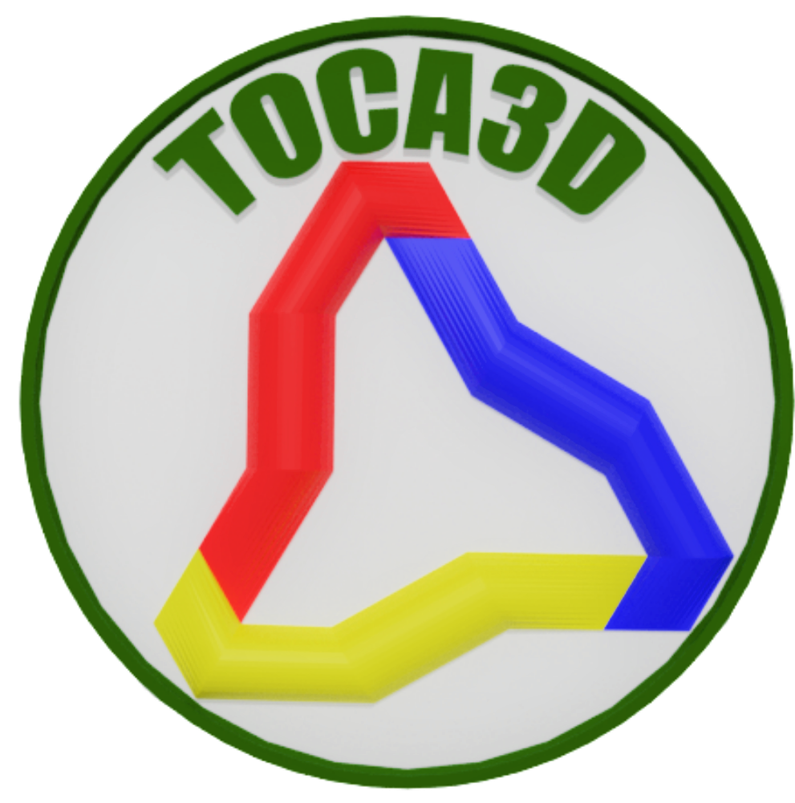

# Toca3D ERP System

<div align="center">



**Sistema ERP completo para gestión empresarial con integración SIFEN**

[](LICENSE)
[](https://www.python.org/)
[](https://www.djangoproject.com/)

</div>

---

## 📋 Descripción

Toca3D es un sistema ERP (Enterprise Resource Planning) moderno y completo diseñado para la gestión empresarial integral. El sistema está construido con Django y utiliza una arquitectura basada en endpoints reutilizables que generan contenido dinámico según los parámetros recibidos.

### Características Principales

- 🏢 **Gestión Multi-Negocio**: Permite a los usuarios gestionar múltiples negocios desde una sola cuenta
- 📄 **Facturación Electrónica**: Integración completa con SIFEN (Paraguay) para generación de documentos electrónicos
- 📦 **Gestión de Inventario**: Control completo de productos, categorías, marcas y stock
- 👥 **Sistema de Usuarios**: Perfiles de usuario con gestión de permisos y negocios asociados
- 🔔 **Notificaciones en Tiempo Real**: Sistema de WebSockets para notificaciones instantáneas
- ⚡ **Tareas Asíncronas**: Procesamiento en segundo plano con Celery
- 📊 **Reportes Dinámicos**: Generación de reportes en PDF con diseño personalizado
- 🎨 **Interfaz Moderna**: UI/UX responsive con Bootstrap 5 y DataTables

---

## 🏗️ Arquitectura

El sistema utiliza una arquitectura modular basada en endpoints reutilizables:

### Endpoints Principales

| Endpoint | Descripción |
|----------|-------------|
| `/set_auth/` | Autenticación de usuarios |
| `/set_logout/` | Cierre de sesión |
| `/iom/` | Ejecuta métodos en cualquier módulo del proyecto según parametrización |
| `/dtmpl/` | Renderiza templates dinámicos con contexto |
| `/api_iom/` | Versión API con autenticación por token |
| `/api_dtmpl/` | Versión API de renderizado de templates |

### Apps del Sistema

- **OptsIO**: Core del sistema - gestión de usuarios, menús, apps, WebSockets
- **Sifen**: Integración con SIFEN para facturación electrónica (Paraguay)
- **Finance**: Módulo de cálculos financieros
- **Anime**: Módulo de ejemplo para desarrollo

---

## 🛠️ Tecnologías

### Backend
- **Django 5.2+**: Framework web principal
- **Python 3.10+**: Lenguaje de programación
- **Celery 5.3+**: Procesamiento asíncrono de tareas
- **Redis**: Message broker y caché
- **Channels 4.0+**: WebSockets y comunicación en tiempo real
- **Daphne**: Servidor ASGI

### Frontend
- **Bootstrap 5**: Framework CSS
- **jQuery**: Manipulación DOM
- **DataTables**: Tablas dinámicas y responsivas
- **Select2**: Selectores avanzados
- **Axios**: Peticiones HTTP
- **SweetAlert2**: Alertas y modales elegantes
- **Inputmask**: Máscaras de entrada para formularios

### Base de Datos
- SQLite (desarrollo)
- Soporte para PostgreSQL/MySQL (producción)

---

## 📋 Requisitos Previos

- Python 3.10 o superior
- Redis Server
- Git
- Node.js y npm (opcional, para gestión de assets frontend)

---

## 🚀 Instalación

### 1. Clonar el Repositorio

```bash
git clone git@github.com:altamachines/toca3d.git
cd toca3d
```

### 2. Crear Entorno Virtual

```bash
python -m venv venv

# Linux/Mac
source venv/bin/activate

# Windows
venv\Scripts\activate
```

### 3. Instalar Dependencias

```bash
# Dependencias principales (crear requirements.txt con todas las deps)
pip install django>=5.2
pip install pillow

# WebSockets
pip install -r requirements-websockets.txt

# Celery
pip install -r requirements-celery.txt
```

### 4. Configurar Base de Datos

```bash
python manage.py migrate
```

### 5. Crear Usuario Administrador

```bash
python manage.py create_amadmin
```

Este comando crea el usuario `amadmin` con contraseña por defecto.

### 6. Configurar Menús Iniciales

```bash
python manage.py setup_sifen_menu
```

### 7. Cargar Datos Maestros SIFEN

Sincronizar RUCs desde la SET y cargar los datos maestros provistos por la SET:

```bash
# Sincronizar RUCs de la SET
python manage.py mng_sifen_mainline --sync_rucs

# Cargar datos maestros
python manage.py mng_sifen_mainline --set_tipo_contribuyente
python manage.py mng_sifen_mainline --load_medidas
python manage.py mng_sifen_mainline --load_actividades
python manage.py mng_sifen_mainline --load_geografias

# Crear apps core del sistema
python manage.py mng_sifen_mainline --create_core_apps
```

### 8. Iniciar Servicios

#### Terminal 1: Django Server
```bash
python manage.py runserver
```

#### Terminal 2: Redis (si no está como servicio)
```bash
redis-server
```

#### Terminal 3: Celery Worker
```bash
celery -A Toca3d worker -l info
```

#### Terminal 4: Celery Beat (tareas programadas)
```bash
celery -A Toca3d beat -l info
```

---

## ⚙️ Configuración

### Variables de Entorno

Crear archivo `.env` en la raíz del proyecto:

```env
# Django
SECRET_KEY=tu-secret-key-aqui
DEBUG=True
ALLOWED_HOSTS=localhost,127.0.0.1

# Database (si usas PostgreSQL)
DB_NAME=toca3d
DB_USER=tu_usuario
DB_PASSWORD=tu_contraseña
DB_HOST=localhost
DB_PORT=5432

# Redis
REDIS_HOST=localhost
REDIS_PORT=6379

# SIFEN (Paraguay)
SIFEN_URL=https://sifen.set.gov.py
SIFEN_CERT_PATH=/path/to/cert.pem
SIFEN_KEY_PATH=/path/to/key.pem
```

### Configuración de Certificados SIFEN

Para usar la integración con SIFEN, coloca tus certificados en:

```
Sifen/certs/
├── tu_certificado.pfx
├── tu_certificado.pem
└── tu_certificado.key
```

---

## 📁 Estructura del Proyecto

```
Toca3d/
├── .claude/                    # Documentación del proyecto para Claude Code
│   ├── context.md             # Contexto general y guidelines
│   ├── crud_patterm.md        # Patrones CRUD y workflows
│   ├── form_ui.md             # Documentación de formularios
│   ├── table_ui.md            # Documentación de tablas
│   ├── javascript_methods.md # Referencia de métodos JS
│   └── memory/                # Sesiones de desarrollo documentadas
├── OptsIO/                    # App principal del sistema
│   ├── consumers.py           # WebSocket consumers
│   ├── io_serial.py          # Serialización y queries (seModel)
│   ├── io_maction.py         # Acciones sobre modelos
│   ├── io_grid.py            # Generación de grids/tablas
│   ├── management/           # Comandos personalizados
│   └── templatetags/         # Template tags personalizados
├── Sifen/                     # Integración facturación electrónica
│   ├── e_kude.py             # Generación de E-Kuatia (facturas)
│   ├── ekuatia_serials.py    # Serialización de documentos
│   ├── impretions.py         # Generación de PDFs
│   └── certs/                # Certificados digitales
├── templates/                 # Templates Django
│   ├── BaseUi.html           # Template base principal
│   ├── AMToolbarUi.html      # Toolbar del sistema
│   ├── AMAppsUi.html         # Sidebar de apps
│   ├── OptsIO/               # Templates de OptsIO
│   └── Sifen/                # Templates de Sifen
├── static/                    # Archivos estáticos
│   ├── amui/                 # JavaScript del sistema
│   │   ├── a_ui.js          # Utilidades UI (OptsIO, UiB)
│   │   ├── form_ui.js       # Manejo de formularios
│   │   └── table_ui.js      # DataTables wrapper
│   └── js/                   # JavaScript adicional
├── docs/                      # Documentación adicional
├── manage.py                  # Django management script
└── requirements*.txt          # Dependencias del proyecto
```

---

## 📖 Uso

### Gestión de Negocios

El sistema permite gestionar múltiples negocios:

- **Crear Negocio**: Desde el menú de usuario → "Negocios" → "Agregar Otro Negocio"
- **Cambiar Negocio Activo**: Menú usuario → "Negocios" → Seleccionar negocio
- **Editar Negocio Activo**: Menú usuario → "Editar Negocio Activo"

### Crear una Nueva Interfaz CRUD

El sistema facilita la creación de interfaces CRUD siguiendo patrones establecidos:

1. **Definir el Modelo** en `app_name/models.py`
2. **Crear Templates**:
   - `templates/AppName/ModeloUi.html` (listado)
   - `templates/AppName/ModeloCreateUi.html` (crear/editar)
3. **Crear Método Backend** en `app_name/mng_*.py`:
   ```python
   def create_modelo(self, *args, **kwargs):
       # Seguir patrón en .claude/crud_patterm.md
   ```
4. **Registrar en Apps** usando Django shell o comando

Para más detalles, consulta `.claude/crud_patterm.md`

---

## 🔧 Desarrollo

### Patrones del Proyecto

El proyecto sigue patrones específicos documentados en `.claude/`:

- **CRUD Operations**: `.claude/crud_patterm.md`
- **Form Patterns**: `.claude/form_ui.md`
- **Table/Grid Patterns**: `.claude/table_ui.md`
- **Backend Queries**: `.claude/record_from_backend.md`
- **JavaScript Methods**: `.claude/javascript_methods.md`

### Reglas Importantes

1. ⚠️ **Variables JavaScript**: Usar `var`, NO `const` o `let` en templates AJAX
2. 🔍 **Verificar Métodos**: Consultar `.claude/javascript_methods.md` antes de usar métodos
3. 📝 **Referencias DOM**: Usar `name` en formularios, no `id`
4. 🚫 **NO usar `{{ rr }}`** en: nombres de funciones, atributos `name` de inputs
5. 📋 **Seguir Patrones**: Usar `MenuCreateUi.html` como referencia para formularios

---

## 📚 Documentación

### Documentación Interna

Toda la documentación del proyecto está en `.claude/`:

- **Guías de Desarrollo**: Patrones, workflows, convenciones
- **Referencia de APIs**: Métodos JavaScript, funciones backend
- **Historial de Sesiones**: Cambios importantes documentados en `.claude/memory/`

### Archivos de Contexto

- `CLAUDE.md`: Historial de cambios principales
- `.claude/context.md`: Guidelines generales del proyecto
- `.claude/memory/`: Sesiones de desarrollo documentadas

---

## 🧪 Testing

```bash
# Ejecutar tests
python manage.py test

# Tests específicos de WebSockets
python OptsIO/testing/test_websocket_user.py

# Tests de notificaciones
python OptsIO/testing/test_task_bell.py
```

---

## 📝 Comandos Útiles

```bash
# Crear usuario amadmin
python manage.py create_amadmin

# Configurar menús iniciales
python manage.py setup_sifen_menu

# Ejecutar Celery worker
celery -A Toca3d worker -l info

# Ejecutar Celery beat
celery -A Toca3d beat -l info

# Monitorear Celery (Flower)
celery -A Toca3d flower

# Crear migraciones
python manage.py makemigrations

# Aplicar migraciones
python manage.py migrate

# Colectar archivos estáticos
python manage.py collectstatic
```

---

## 🤝 Contribución

1. Fork el proyecto
2. Crea una rama para tu feature (`git checkout -b feature/AmazingFeature`)
3. Commit tus cambios (`git commit -m 'Add some AmazingFeature'`)
4. Push a la rama (`git push origin feature/AmazingFeature`)
5. Abre un Pull Request

### Estándares de Código

- Seguir los patrones establecidos en `.claude/`
- Documentar cambios importantes en `.claude/memory/`
- Usar los helpers JavaScript existentes (OptsIO, UiB, Form, Grid)
- NO inventar métodos que no existen

---

## 📄 Licencia

Este proyecto está bajo la licencia especificada en el archivo [LICENSE](LICENSE).

---

## 👥 Autores

- **AltaMachines Team** - [AltaMachines](https://github.com/altamachines)

---

## 🙏 Agradecimientos

- Django Framework
- Bootstrap Team
- DataTables
- Select2
- Comunidad de código abierto

---

## 📞 Contacto

- **GitHub**: [@altamachines](https://github.com/altamachines)
- **Email**: pjmakey2@gmail.com

---

<div align="center">

**Desarrollado con ❤️ por AltaMachines**

</div>
